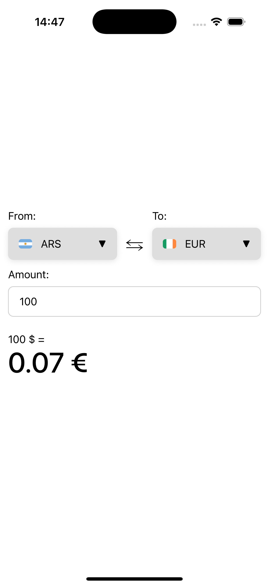
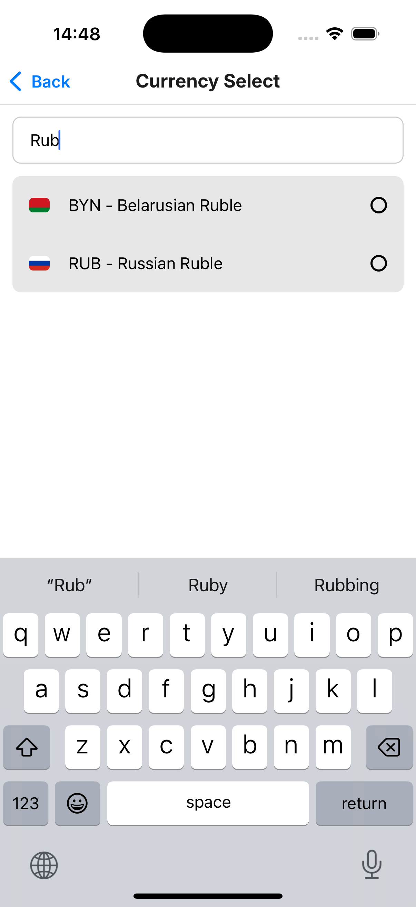
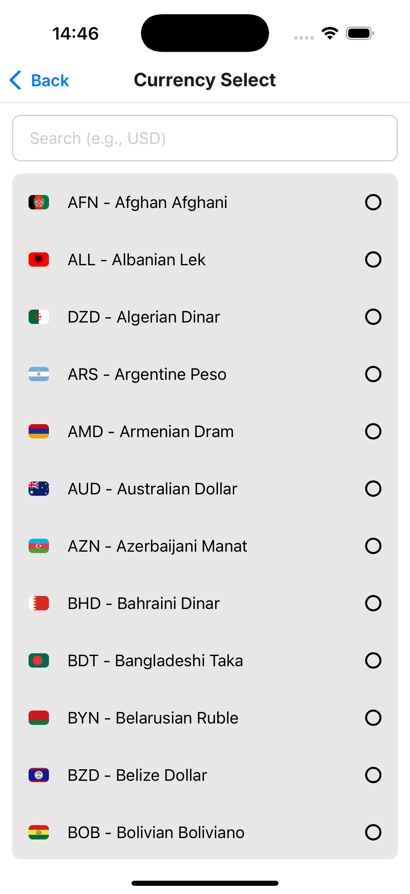
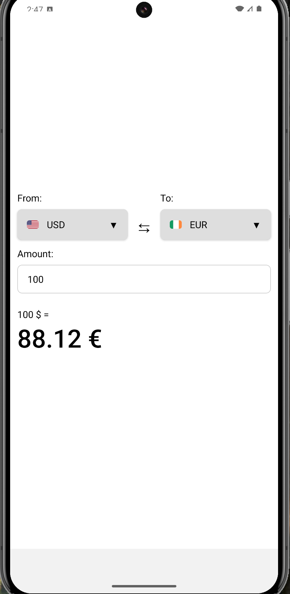
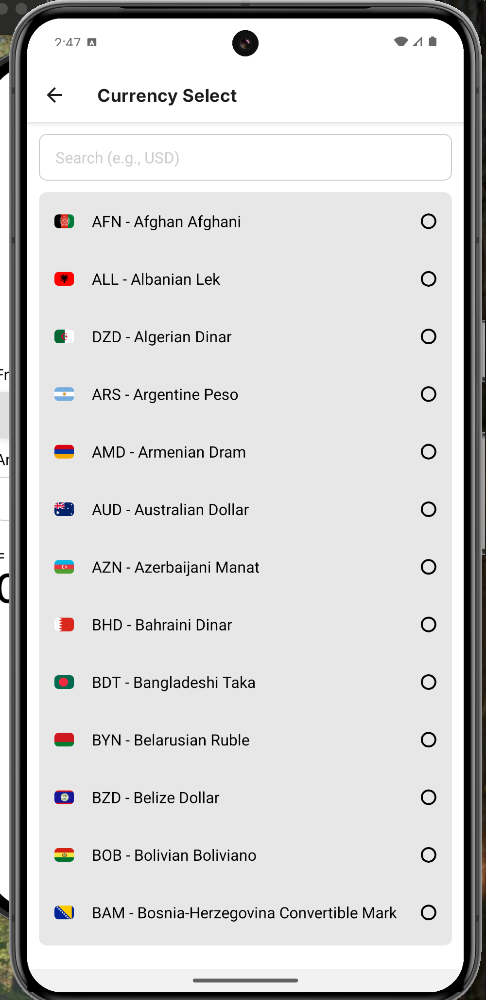
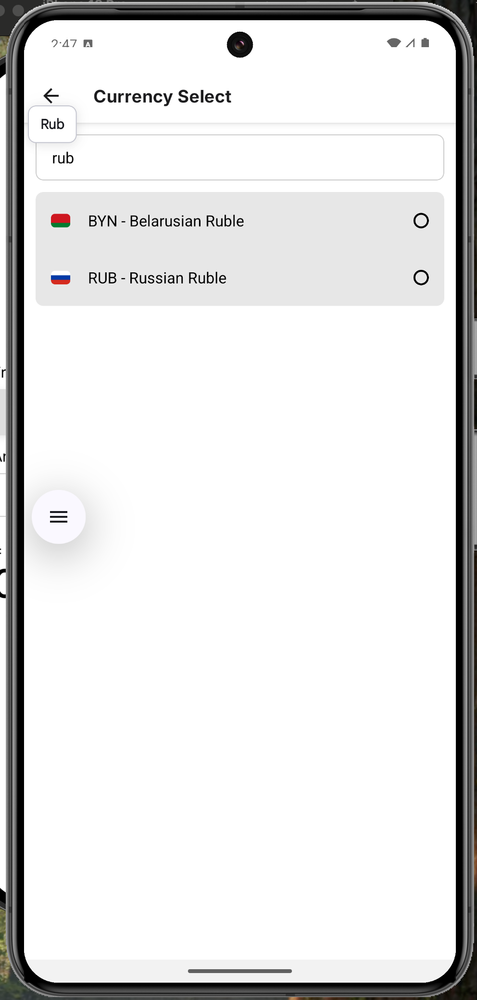

# MyApp - Мобильное приложение на React Native

## Описание проекта

MyApp - это современное мобильное приложение, разработанное с использованием React Native и Expo. Приложение предоставляет пользователям удобный интерфейс для работы с различными функциями и сервисами.

## Технологический стек

- React Native 0.79.2
- Expo SDK 53
- TypeScript
- React Navigation
- Axios для HTTP-запросов
- MMKV для локального хранилища
- Reanimated для анимаций
- FlashList для оптимизированных списков

## Структура проекта

```
myapp/
├── app/                    # Основной код приложения
│   ├── _layout.tsx        # Корневой layout приложения
│   ├── index.tsx          # Главная страница
│   ├── explore.tsx        # Страница исследования
│   └── +not-found.tsx     # Страница 404
├── src/                    # Исходный код
├── assets/                # Статические ресурсы
├── ios/                   # iOS специфичные файлы
├── android/               # Android специфичные файлы
└── scripts/               # Вспомогательные скрипты
```

## Основные функции

- Навигация между экранами с использованием React Navigation
- Оптимизированные списки с использованием FlashList
- Локальное хранение данных с MMKV
- Анимации и жесты с Reanimated
- Поддержка TypeScript для типобезопасности
- Интеграция с веб-сервисами через Axios

## Установка и запуск

### Предварительные требования

- Node.js
- npm или yarn
- Expo CLI
- iOS Simulator (для Mac) или Android Studio (для Android)

### Установка зависимостей

```bash
npm install
# или
yarn install
```

### Запуск приложения

```bash
# Запуск в режиме разработки
npm start
# или
yarn start

# Запуск на iOS
npm run ios
# или
yarn ios

# Запуск на Android
npm run android
# или
yarn android
```

## Сборка для Android

### Debug сборка

Debug APK можно найти по пути:

```
android/app/build/outputs/apk/debug/app-releaw.apk
```

### Скриншоты приложения








## Разработка

- Используется ESLint и Prettier для форматирования кода
- Настроен Husky для pre-commit хуков
- TypeScript для статической типизации
- Модульная структура для удобной разработки

## Лицензия

Private - Все права защищены
